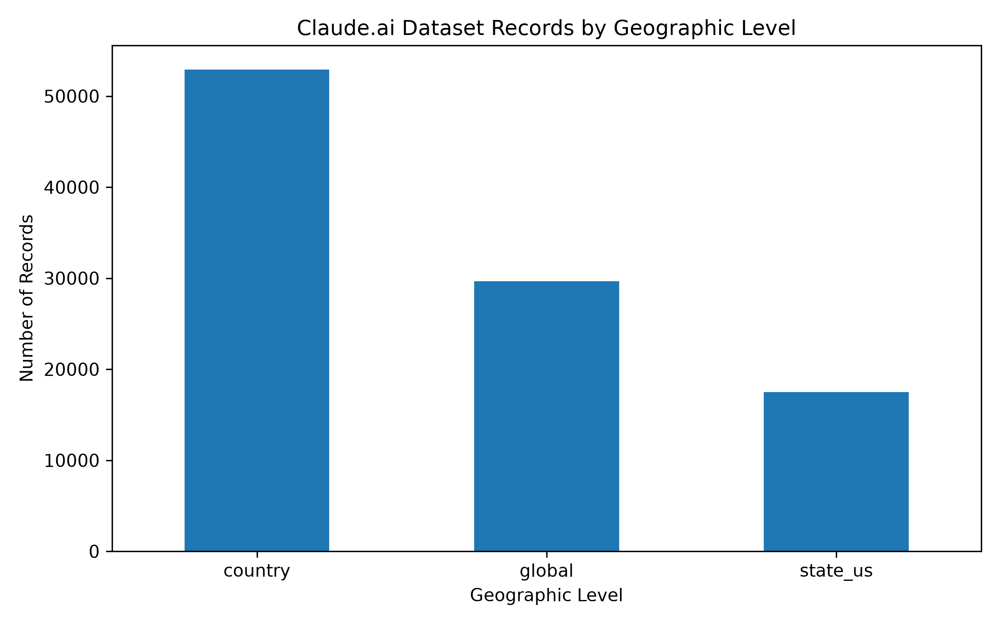
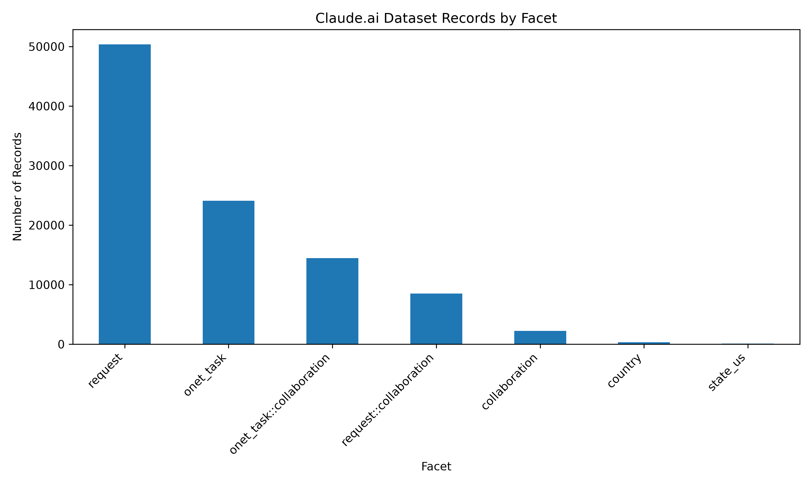
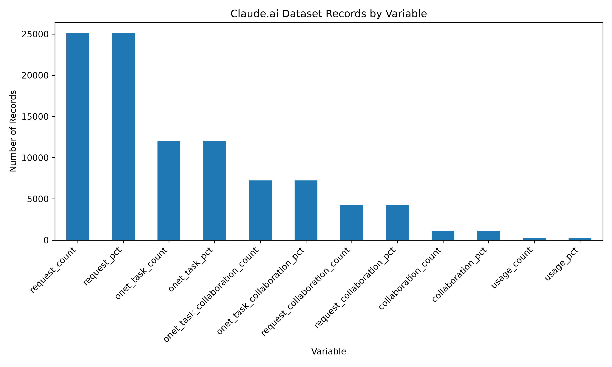
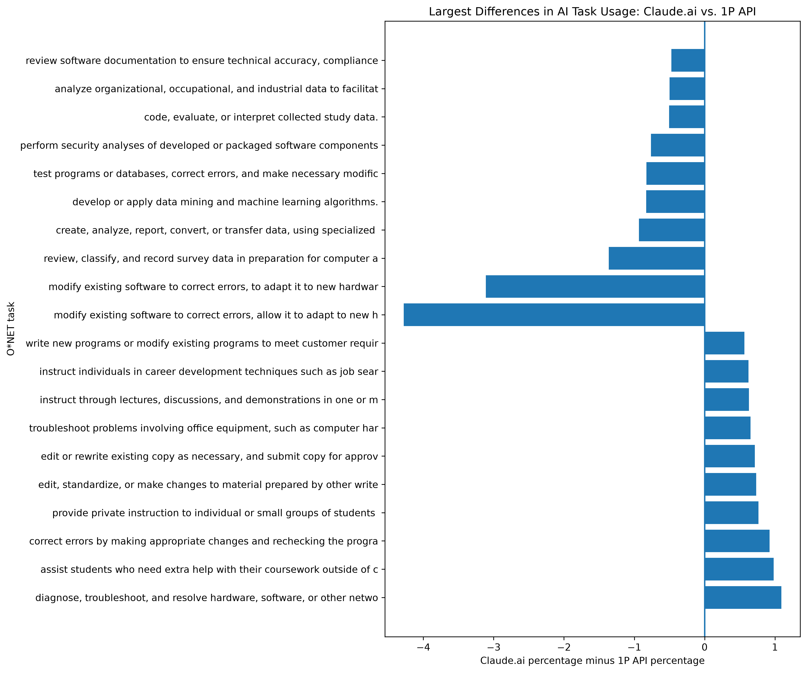

# Claude.ai Dataset Profile

## Dataset Overview

The Claude.ai dataset contains 100,062 records and 10 columns. It describes Claude.ai usage across different geographic levels and several types of measurements, including requests, tasks, collaboration, and usage counts.

The dataset covers three geographic levels: country, global, and U.S. state. Most records are at the country level, followed by global records and then U.S. state records.

The dataset will be used to investigate the research question:

> **Do consumers and businesses use AI differently on the same tasks?**

## Geographic Coverage

The dataset contains records at three geographic levels:

- **Country:** 52,918 records
- **Global:** 29,656 records
- **U.S. state:** 17,488 records

Country-level records make up the largest portion of the dataset, followed by global records and U.S. state records. This shows that the dataset provides substantial geographic coverage while also including aggregated global-level information.

### Geographic Coverage Plot

**Figure 1.** Number of Claude.ai dataset records by geographic level. Country-level records are the most common, followed by global and U.S. state records.

## Facet Distribution

The dataset contains several different facets that describe how Claude.ai usage is measured:

- **Request:** 50,346 records
- **ONET task:** 24,080 records
- **ONET task collaboration:** 14,454 records
- **Request collaboration:** 8,508 records
- **Collaboration:** 2,224 records
- **Country:** 346 records
- **U.S. state:** 104 records

Request-level records are the largest category, followed by ONET task records. The dataset also contains several collaboration-related facets, which are particularly relevant to this project because they provide information about how people and AI work together on tasks.

### Facet Distribution Plot

**Figure 2.** Number of Claude.ai dataset records by facet. Request and ONET task records make up the largest portions of the dataset, while collaboration-related facets provide additional information about AI-human task interaction.

## Variable Distribution

The dataset contains several types of variables that measure different aspects of Claude.ai usage. The most common are request counts and percentages, followed by ONET task measures and collaboration measures.

The main variable categories are:

- **Request count:** 25,173 records
- **Request percentage:** 25,173 records
- **ONET task count:** 12,040 records
- **ONET task percentage:** 12,040 records
- **ONET task collaboration count:** 7,227 records
- **ONET task collaboration percentage:** 7,227 records
- **Request collaboration count:** 4,254 records
- **Request collaboration percentage:** 4,254 records
- **Collaboration count:** 1,112 records
- **Collaboration percentage:** 1,112 records
- **Usage count:** 225 records
- **Usage percentage:** 225 records

The count and percentage variables appear in matching pairs for most measures. This allows the dataset to describe both the number of observations and their relative share within the relevant category.

### Variable Distribution Plot

**Figure 3.** Number of Claude.ai dataset records by variable. Request count and request percentage are the most common variables, followed by ONET task measures.

## Missing Values

Most columns in the Claude.ai dataset contain no missing values. The two columns with missing values are `geo_id` and `cluster_name`.

- `geo_id`: 22 missing values (0.02%)
- `cluster_name`: 450 missing values (0.45%)
- All other columns: 0 missing values

The percentage of missing values is very small, with the highest missingness occurring in `cluster_name` at 0.45%. This suggests that missing data is limited in the dataset and is unlikely to affect the overall descriptive profile substantially.

## Relevance to the Research Question

The dataset provides information about different types of Claude.ai tasks, including requests, ONET tasks, and collaboration-related tasks. These categories provide a foundation for comparing how AI is used across different settings.

The distinction between collaboration measures and task categories is especially useful for the research question, **“Do consumers and businesses use AI differently on the same tasks?”** The Claude.ai dataset provides information about different types of AI tasks and collaboration patterns that can later be compared with the corresponding first-party API data.

The descriptive profile shows that the dataset contains enough task and collaboration information to investigate differences in AI use. Further analysis will be needed to determine whether consumers and businesses actually use AI differently on comparable tasks.

## Claude.ai vs. 1P API Task Comparison

To directly examine the research question, I compared global O*NET task percentages in Claude.ai and 1P API usage. After excluding `none` and `not_classified`, 1,603 tasks appeared in both datasets and could be directly compared.

The largest differences show that some educational, writing/editing, and troubleshooting tasks have higher representation in Claude.ai, while software modification, data processing, machine learning, and security-related tasks have higher representation in 1P API usage.

**Figure caption:** Largest differences in global O*NET task usage between Claude.ai and 1P API. Positive values indicate higher representation in Claude.ai, while negative values indicate higher representation in 1P API.

# EDA of New Research Question

## Top 20 Occupations by AI Penetration
Bar chart shows occupations most represented in AI usage.  
"Not Classified" is the highest — this consists of ambiguous or mixed requests.  
Computer and Mathematical is the highest real occupation group.  
Educational Instruction & Library, Arts & Media, Office Support, and Life & Physical Sciences follow behind.

.png")

### Interpretation
AI is used most heavily in technical, creative, and educational domains.  
Occupations like Food Service, Healthcare Support, Transportation, etc. show very low penetration, meaning AI is not commonly used in those job categories.

---

## Distribution of AI Penetration Across Occupations
Histogram showing overall spread of AI penetration across all occupations.  
The distribution is heavily right‑skewed.  
Most occupations have low AI penetration (near zero).  
Only a few occupations have high penetration (up to ~60%).

### Interpretation
AI usage is not evenly distributed across the labor market.  
A small number of occupations are highly AI‑exposed, while most occupations barely interact with AI at all.

---

## Average AI Penetration by Occupation Group
The bar chart shows average penetration for each occupation group.  
Highest is Computer and Mathematical.  
Educational, Arts & Media, Office Support, Science, Business, and Community Service follow.  
Construction, Protective Service, Food Prep, Healthcare Support, and Transportation are very low.

## Interpretation
AI is concentrated in knowledge‑work and creative fields.  
Manual labor, service work, and physical jobs have minimal AI exposure.

## Bottom 20 Occupations
        Occupations                            pct
Construction and Extraction                  0.102154
Building and Grounds Cleaning                0.126631
Protective Service                           0.159052
Transportation and Material Moving           0.177936
Healthcare Support                           0.194366
